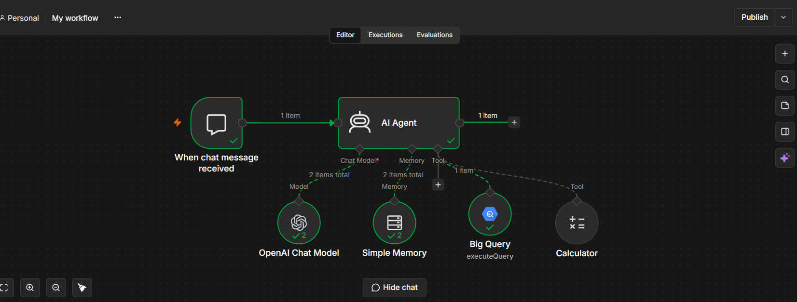

# 🤖 n8n AI Agent - Automated BigQuery Data Analyst (Lyly)

Một hệ thống AI Agent tự động hóa trên **n8n** đóng vai trò Chuyên gia Phân tích Dữ liệu (**Lyly**). Agent có khả năng tiếp nhận câu hỏi bằng ngôn ngữ tự nhiên, tự động sinh câu lệnh **Google BigQuery SQL**, gọi Tool để truy vấn cơ sở dữ liệu thực tế và tổng hợp báo cáo kinh doanh cho người dùng.

---

## 🌐 Ngôn Ngữ & Công Nghệ Sử Dụng (Languages & Tech Stack)

### 1. Ngôn Ngữ & Chuẩn Dữ Liệu (Languages & Data Standards)
- **SQL (Google Standard SQL)**: Tự động truy vấn, gom nhóm (`GROUP BY`), sắp xếp (`ORDER BY`) và tính tổng dữ liệu trên Google BigQuery.
- **JSON**: Định dạng cấu trúc dữ liệu giao tiếp giữa các node n8n, lưu trữ lịch sử bộ nhớ (`chatHistory`) và truyền nhận dữ liệu API.
- **Vietnamese Natural Language Processing**: AI Agent (Lyly) hiểu và xử lý ngữ cảnh câu hỏi bằng tiếng Việt tự nhiên, chuyển đổi yêu cầu của người dùng thành câu lệnh truy vấn dữ liệu chính xác.
- **Markdown**: Định dạng đầu ra của báo cáo phân tích (kết quả hiển thị rõ ràng với bảng, danh sách và font in đậm các số liệu quan trọng).

---

### 2. Công Nghệ & Công Cụ (Tech Stack & Frameworks)
- **Workflow Automation**: `n8n` (Node-based Automation Engine)
- **AI / LLM Core**: `OpenAI API` (Model Engine: `openai/gpt-oss-120b`)
- **Data Warehouse**: `Google BigQuery`
- **Agentic Framework**: `n8n AI Agent` + `Simple Memory` (LangChain-based Architecture)

---

## 📌 Tính Năng Nổi Bật

- 💬 **Truy vấn Ngôn ngữ Tự nhiên (NLQ)**: Người dùng chỉ cần gửi câu hỏi bằng tiếng Việt bình thường (như hỏi doanh số, nhân viên xuất sắc, sản phẩm bán chạy), AI sẽ tự hiểu logic kinh doanh.
- 🛠️ **Dynamic Function Calling / Tool Usage**: AI Agent tự động sinh tham số SQL dựa trên hàm `$fromAI()` và thực thi truy vấn trực tiếp vào Google BigQuery mà không cần lập trình viên can thiệp.
- 🧠 **Contextual Window Memory**: Sử dụng node `Simple Memory` với cơ chế quản lý Session Key (`{{ $json.sessionId }}`) giúp lưu vết đến 10 lượt hội thoại gần nhất để hỗ trợ các câu hỏi nối tiếp.
- 📊 **Cấu trúc dữ liệu rõ ràng (Data Schema Aware)**: AI Agent được huấn luyện ngữ cảnh về bảng dữ liệu `chocolate_data` giúp truy vấn chính xác từng tên cột.

---

## 🏗️ Kiến Trúc Workflow (System Architecture)

Workflow được xây dựng bằng kiến trúc Agentic trên n8n bao gồm các node chính:

1. **When chat message received (Chat Trigger)**: Điểm tiếp nhận dữ liệu đầu vào từ giao diện Chat.
2. **AI Agent (Core Engine)**: Node điều phối trung tâm chứa System Prompt định hình vai trò Chuyên gia Phân tích Dữ liệu Lyly.
3. **OpenAI Chat Model (`openai/gpt-oss-120b`)**: LLM đóng vai trò bộ não suy luận và tạo câu lệnh SQL.
4. **Simple Memory (Window Buffer)**: Quản lý bộ nhớ ngắn hạn theo từng phiên trò chuyện (`sessionId`).
5. **Google BigQuery Tool (`executeQuery`)**: Thực thi câu lệnh SQL động do AI truyền vào và trả về bảng kết quả (133 items).
6. **Calculator Tool**: Hỗ trợ AI thực hiện các phép tính số học bổ trợ khi cần.

---

## 📂 Bảng Dữ Liệu Mẫu (Database Schema)

- **Dataset ID**: `chocolate-data-510411.chocolate_data.doanh_so_ban_hang_chocolate`
- **Các trường dữ liệu (Fields)**:
  - `Sales_Person` (*string*): Tên nhân viên bán hàng
  - `Country` (*string*): Quốc gia giao dịch
  - `Product` (*string*): Tên sản phẩm
  - `Date` (*date*): Ngày giao dịch (`DD-MMM-YYYY`)
  - `Amount` (*integer*): Tổng doanh số
  - `Boxes_Shipped` (*integer*): Số lượng hộp sản phẩm

---

## 🚀 Hướng Dẫn Cài Đặt & Khởi Chạy

### 1. Import Workflow
1. Tải tệp `AI agent big query.json` trong repository này.
2. Mở giao diện n8n -> Chọn **Workflows** -> **Import from File**.

### 2. Cấu hình Credentials
- **OpenAI Account**: Thêm API Key có quyền truy cập model AI tương ứng.
- **Google BigQuery Service Account / OAuth2**: Cấp quyền đọc (`BigQuery Data Viewer`) trên project `chocolate-data-510411`.

### 3. Trải nghiệm
Bật khung **Chat** trong n8n và gửi câu hỏi:
> *"Ai là nhân viên bán hàng có doanh số cao nhất?"*
